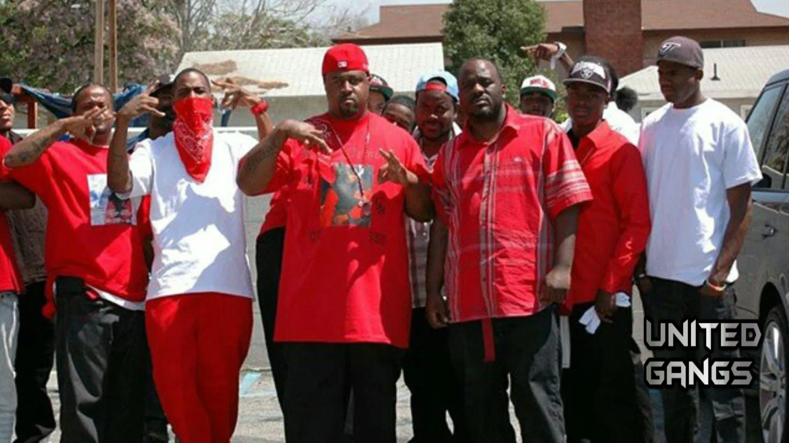
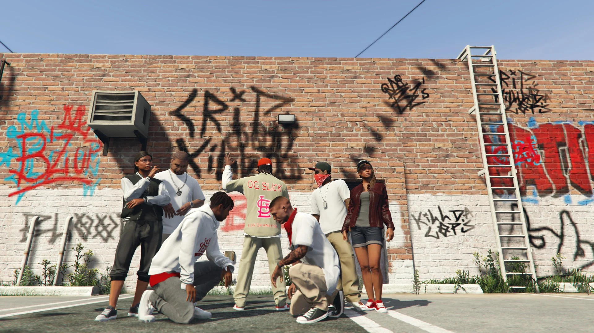

# 🧰 Notice Méta Gang


Cette notice est ce qui va vous servir de guide concernant le RP gang de rue de Los Angeles. Inspirez-vous-en au maximum afin d'avoir un meilleur réalisme en jeu.


## <mark style="color:blue;">1. MENTALITÉ AMÉRICAINE</mark> 

\
Les Etats-Unis est un pays connu pour son rêve américain, c'est un pays où l'on peut partir de rien et monter dans les plus hautes sphères du pays, c'est ce qui rend les Etats-Unis fascinant. En revanche, c'est aussi un pays qui peut amener à vivre un cauchemar américain, c'est -à -dire une descente aux enfers très rapidement et dans un milieu très sale.&#x20;

Les Etats-Unis ne fournissent pas autant d'aides qu'en France. Les minorités aux Etats-Unis se démarquent donc par une certaine mentalité de débrouillard et sont en général méfiantes de tout le monde, ils ne peuvent compter que sur eux-mêmes. C'est ce qui crée tous ces sets où chacun pense être le groupe le plus "Real".

La culture des gangs met en avant un aspect de séparation entre communauté et mentalité. Les gangsters américains aiment bien se montrer, montrer leur appartenance, leur argent, leur pouvoir, etc ...

## <mark style="color:blue;">2. STYLE VESTIMENTAIRE</mark> 

\
Il y a deux types de style vestimentaire à Los Santos. Il y a la Old School et la New School.&#x20;

\- Old School : Ce style est principalement constitué de vêtements très larges, tels que des baggy, gros t-shirt, grosses vestes. Ce style est encore très présent dans les quartiers latinos.\
\- New School : Ce style est principalement constitué de marques de luxe ( Moncler, Amiri, etc ... ), jeans assez serré et baissé, paire de baskets très hype ( Jordan 4, Jordan 1 ... ). Ce style est très présent chez les jeunes et très inspiré de New-York.&#x20;


Les hoods mettent beaucoup d'habits d'équipe de foot us, basket, hockey et baseball. Maillots, casquettes, vestes par exemple. Les chaînes sont aussi très importantes dans le style et qui vont définir si c'est un mec qui fait du biff ou pas.


<figure><figcaption></figcaption></figure>

## <mark style="color:blue;">3. COMPORTEMENT QUOTIDIEN</mark> 


Le comportement des set members dans la vie n'est pas comme on peut le voir à la télé, ils ne tirent que très peu et ne se battent pas tous les jours, ce sont des humains comme tout le monde. Il faut savoir que l'ambiance dans un hood est très chaleureux et familial, les "gangsters" ne sont pas si méchants que ça du moins ils le sont seulement contre leurs opps.


Un gangsta traîne beaucoup à pieds et en BMX, ils traînent partout dans son hood pour le revendiquer. Les gangsta fument beaucoup de Weed et boivent beaucoup d'alcool ( surtout du cidre ).\
\
Les set members vont souvent squatter leurs quartier de manière logique, leur but est de montrer aux opps qu'ils sont présents partout et qu'ils ne laisseront personne marcher chez eux.\
Type de spot :\
\- Un <mark style="color:orange;">**spot clique**</mark> est un squat d'une clique dans lequel il passe un maximum de temps entre membre de la clique. \*( Exemple : Un coin de rue, un parking, en bas d'un block )\*\
\- Un <mark style="color:orange;">**set place**</mark> est une zone où tout le set peut se rejoindre ensemble ( toute cliques comprises )\*( Exemple : Ballas = Supérette, Marabunta = coiffeur, Families = Binco, etc ... )\*\
\- Un <mark style="color:orange;">**hang-out**</mark> endroit neutre où tout le monde peut venir _( Exemple : SkatePark Little Séoul, SkatePark Vespucci Beach, Salle de boxe à Davis, etc ... )_ C'est peuplé et surveillé on évite donc les tirs.&#x20;

<figure><figcaption></figcaption></figure>

## <mark style="color:blue;">4. SOURCE D'ARGENT</mark> 

\
\- <mark style="color:yellow;">Trafic et vente de drogue</mark> : C'est le moyen le plus utilisé, il y a beaucoup de dealer dans un set.\
\- <mark style="color:yellow;">Scam</mark> : Le fait d'arnaquer les gens de plusieurs manières, vendre des fausses entrés au bar, arnaquer de la dope, etc ... ( soyez inventif )\
\- <mark style="color:yellow;">Recel</mark> : vente d'objets divers ( exemple : tabac et alcool )\
\- <mark style="color:yellow;">Jobs Légaux</mark> : Vigil, être artiste, travailler dans une société ( tabac/alcool ...). _Vous pouvez bien évidemment évoluer là où vous travailler._\
\- <mark style="color:yellow;">Vol et racket</mark> : Un gangster peut être un voleur d'habits, de voitures et de divers objets. Le racket est une banale chose pour se faire un petit billet, ce n'est pas un travail.

## <mark style="color:blue;">5. LES BEEFS</mark> 

\
Un beef c'est le fait qu'une embrouille éclate entre 2 personnes, 2 groupes, 2 cliques ou 2 set ( rarement ). L'origine de l'embrouille peut être dû au passé et elle est poursuivie par prétexte que les anciens ont toujours fait la guerre donc la guerre continue ou cela peut venir d'une arnaque, d'une bagarre, d'un dissrespect, d'une menace, de racket. Le comportement Gangsta amènera tôt ou tard des beefs car c'est un comportement provocateur, que ce soit dans la démarche, le choix de sa casquette, comment il parle, etc ...

Les issues à un beef :\
1 - <mark style="color:orange;">**La discussion**</mark> : Une fois croisé dans la rue, un des deux côtés va interpeller l'autre afin d'arrêter le beef car ça mène à rien, perte de temps et perte d'argent. Cet acte est généralement pris pour un comportement de lâche mais certains peuvent penser que c'est un acte réfléchi.\
2 - <mark style="color:orange;">**La mort**</mark> ( même de tout le set ) : Pendant un beef le fait d'aller tiré sur ses opps est une possibilité et la mort peut être une issue. Abandon des amis du mort qui vient afin d'expliquer qu'ils ne vont pas continuer la guerre ou la mort de tous les opps qui fait que la guerre est terminée.


Ce n'est pas parce qu'un membre du set est en embrouille avec quelqu'un que tout le set est automatiquement lié au beef. Un beef entre set se créer lorsque beaucoup de membres du set commence à s'impliquer dans le beef. Un beef ne veut pas dire aller tirer directement c'est tout un comportement d'opposition envers vos ennemis, bagarre, insulte et aussi les tirs quand il faut.


## <mark style="color:blue;">6. LES REVENDICATIONS</mark> 

\
Les membres de set revendiquent constamment leurs quartiers, affiliations, sets, cliques, point de drogue, etc ... Les revendications se font de plusieurs manières :\
\
\- La présence physique en squattant un spot, set place ou hang-out.\
\- Les paroles dites quand un inconnu est présent ( nom du set, de la rue, son grade, blaze d'un ami mort pour le quartier, etc ... ( dans le rap et freestyle aussi )\
\- Les habits servent à montrer son appartenance. L'utilisation des casquettes, maillots et bandanas d'équipe NBA, NHL, NFL et MLB sont omniprésentes dans les sets.\
\- Les signes de gang servent à montrer d'où tu viens, ton affiliation ( Gang ) et set.

## <mark style="color:blue;">7. LA HIERACHIE D'UN GANG</mark> 


Tout d'abord, il faut savoir que dans un gang ou un set il n'y a pas de chef qui contrôle tout.


Voici le fonctionnement d'un set :

1 - Résident : Un habitant d'un quartier qui n'est pas du tout mêlé à l'activité du gang.\
2 - Résident approchant : Un habitant d'un quartier qui a pour but de rejoindre le set.\
3 - Set Member : Membre du set.\
\
En étant membre d'un set, il y a encore plusieurs niveaux au sein du gang. Ce sont des rôles qui s'acquièrent en fonction de l'ancienneté dans le gang, l'activité et les actes commis. Ce rôle s'attribue par les dires des autres membres.\
\
1 - YG : C'est un rôle très commun dans le gang. Il vient d'entrer dans le set.\
2 - Gangsta : C'est un set member validé dans son set. Qui a pas mal fait pour le set et qui accepté des autres.\
3 - OG : Le rôle le plus important dans un gang. Il s'acquiert obligatoirement par l'ancienneté ( IRL = min 10 ans, In RP = min 6 sem ) et ensuite en fonction des actes dans le gang. Un OG devient OG soit parce qu'il incarne un grand respect ou une grande crainte.

## <mark style="color:blue;">8. LES ÉVÉNEMENTS INTER-GANGS</mark> 

\
\- <mark style="color:orange;">**BikeLife**</mark> c'est un mode de vie, tout tourne autour de la moto pour eux. Ils manifestent un mécontentement envers une critique ( de l'État ou autre ) ou pour fêter quelque chose en faisant des rodéos. Beaucoup de set members ont cette mentalité et la plupart pratiquent habituellement la bécane.\
\- <mark style="color:orange;">**Les rendez-vous combat clandestin**</mark> est une banale ( dans des lieux abandonnées il peut avoir des événements de combats clandestin, ici le but est de faire de l'argent et non pas se battre pour le set )\
\- <mark style="color:orange;">**Les soirées et showcases**</mark> Ce sont des événements où sont souvent présents des membres de set. Les lieux sont généralement des trap-house et des clubs, que ce soit la sécurité du Club ou la présence de plusieurs autres set members dans la trap-house, un gangster ne vient pas avec une arme pendant la fête.\
\
Il existe événements assez spéciaux dans un hood :\
\- <mark style="color:orange;">**HoodDay**</mark> = Une journée de bonne ambiance qui peut être due à une signature de Label, mariage d'un ami, anniversaire par exemple. C'est un moment d'amusement où tout le set se réunit pour boire fumer et faire la fête.\
\- <mark style="color:orange;">**HomiesDay**</mark> = Une journée de tristesse pour rendre hommage à un ami mort. L'ambiance est triste pendant toute la journée. Pas de musique joyeuse ni de comportement joyeux. À la mort d'un grand OG, une scène d'enterrement et de marche est à prévoir ! ( Un set rival peut s'inviter par respect aux funérailles )

<figure><figcaption></figcaption></figure>

## <mark style="color:blue;">10. EXTRAS !</mark> 

### <mark style="color:red;">**Lexique :**</mark>

OPPS ( OPPOSITION ) — Désignant les ennemis à son set.\
SLIDE — Bouger ( se déplacer )\
SQUABBLE — Bagarre en 1vs1. Cela peut concerné deux simples civils comme deux mecs du même set ou de sets ennemis.\
BLUNT — Joint\
HOMIE/HOMEBOY — Mec de son quartier\
GOON — Terme désignant un soldat de son set, un mec h24 dans son set.\
BLOCK/HOOD/SET/STREET — Désignant un quartier.\
PULL UP — Débarquer dans un hood pour sauter un ennemi ( avec arme ou non ) ou attraper.\
GLOCK/NINE — Une arme à feu.\
COPS/CRASH — Désignant la police\
LACKIN — Ne pas être armé, être en manque d'arme ( Exemple : Renoi c'est chaud j'suis Lackin à VineWood )\
NO LACKIN — Être armé, manque pas d'arme sur sois ( Exemple : No Lackin mon boy, dit leur de venir que je m'en occupe !! ) CUZZ — Désignant un ami proche ( Cousin )\
BLOOD — mot avec lequel s'appelle les set Bloods entre eux.\
BEEF — Clash, embrouille ou désaccord avec quelqu'un ou une autre équipe.\
FUCKED UP — Être défoncer sous drogue.\
CRACKER — Désignant un blanc de manière péjoratif.\
HUSTLERS — Débrouillard dans la rue.\
TWEAKIN — Être perdu, dire n'importe quoi.\
JUNKY — Client de drogues douces.\
CRACKHEAD — Client de drogues dures.\
GOOFY ASS/DUMB — Terme désignant à insulter une personne stupide.\
SLAG/HOE — Pute/Salope.\
BODIES — Un ou des meurtres.\

<mark style="color:orange;">**Contact avec la LSPD :**</mark>

La LSPD est une force avec laquelle on ne rigole pas. Ils peuvent aller là où ils veulent peu importe le quartier ( c'est leur but !! ). Il est évident qu'ils ne vont pas se permettre de parler d'une mauvaise manière ou faire n'importe quoi là où il y a beaucoup de "potentiel" gangster ( exemple : set place ).\
\
Dans les hoods la police est perçue comme une menace que ce soit du côté civil pour les bavures ou pour les trafics illégaux du set. Il faut partir du principe qu'avec un appel radio du renfort arrive directement donc ne pas se permettre n'importe quoi et si tu tente à toi de prendre tes jambes à ton cou !


Discutez avec un cops n'est pas interdit, il peut être mal vu auprès des autres qui vont penser que tu snitch.

