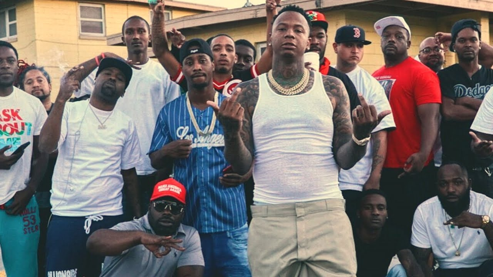

# ⚔ Système illégal


Hey homies ! Vous allez trouvé toutes les informations, conseils et règles afin de pouvoir RolePlay dans l'illégal en sérénité. Prenez le temps de lire attentivement cette page qui va être la base du fonctionnement de votre RP.


## <mark style="color:purple;">**GTA / IRL**</mark> 

Sur GtaSantos nous mélangeons l'histoire de Grand Theft Auto et l'histoire réelle, ce choix est dû au fait que Los Santos (Ville) et San Andreas (Etat) sont une copie complète de Los Angeles et la Californie. Même style de vie, même température, même ville !\
Nous garderons bien évidemment le nom de Los Santos vu que la map est Los Santos.\
\
Pour les factions de GTA, vous devrez vous informer sur les différents forums expliquant les faites passés de la faction dans le jeu.  \
Pour les factions réelles, vous devrez vous informer en regardant des documentaires, thread, forum afin de connaître l'histoire.\
\
Le comportement d'un personnage est cohérent lorsqu'il est inspiré de la vraie vie. Si vous incarnez un mafieux d'une faction GTA ou que vous incarnez un mafieux d'une faction réel, le comportement mafieux reste le même, ce n'est que l'histoire qui change. \
Référez-vous à la vraie vie afin d'avoir la meilleure cohérence.\
_Les factions de cohérence GTA sont inspirés des gangs de la vraie vie, Ballas=Bloods, Aztecas=18th street gang, Vagos=Sureños._

## <mark style="color:purple;">**Factions illégales**</mark> 

Le monde criminel à Los Angeles est très vaste. Nous y trouvons généralement les gangs de rue, les clubs de motards, les familles influentes ainsi que des affiliations à des mafias et Cartel. Ils sont tous là pour la même chose, le respect, l'argent et le pouvoir. La différence entre ces groupes-là c'est la manière de faire et d'être et cela s'apprend et se développe en fonction de vos références\
( films, séries, docs ).\
\
Choisissez une faction en fonction de ce que vous avez envie d'incarner ou de vos références. Ce n'est pas un jeu d'équipe en sois, vous choisissez le rôle que vous voulez incarner et votre équipe se créera en jeu.\
Faites le même projet avec vos amis que si vous voulez faire le même type de RolePlay !

### <mark style="color:green;">**Gang de rue :**</mark> <mark style="color:purple;">**Ballas**</mark>** - **<mark style="color:green;">**Families**</mark>** - **<mark style="color:yellow;">**Vagos**</mark>** - **<mark style="color:blue;">**Marabunta**</mark>**  - **<mark style="color:red;">**Bloods**</mark>

Les gangs de rue sont le plus présent à Los Angeles, c'est la naissance des Bloods et des Crips et c'est la où sont présents le plus de gang latino dû au rapprochement géographique avec le Mexique. Los Angeles est la source de l'histoire des gangs aux USA. C'est une culture, un lifestyle et une vision des choses unique au monde. Il faut se mettre dans la peau des jeunes des quartiers les plus défavorisés des USA, et qui par appât du gain, par rage ou par la culture de la rue vont s'affiliés aux gangs de leurs quartiers.\
Les références les plus connus sont NWA, Boyz'n The Hood, Nipsey Hussle, YG, ... \
Un bon RolePlay gangster c'est quand vous allez réussir à reproduire une vie de gangster qui aurait pu ou qui a dû déjà exister, le lifestyle, l'ambiance, les conflits, la manière de faire et d'être que vous avez remarqué dans vos références.&#x20;

<figure><figcaption></figcaption></figure>

### **Mafia / Cartel : Cosa Nostra - Mafia Albanaise - Cartel MS-13**

Les affiliations aux cartels et mafias à Los Angeles existent et très fortement mais leur comportement n'est pas comme dans leur pays d'origine. Un cartel mexicain ne va pas se comporter comme s'il était au Mexique, il est bien plus compliqué corrompre aux USA et les fédéraux ne sont pas impuissants face à n'importe qui. Ces organisations se font discrètes aux Etats-Unis, ils sont là pour créer des contacts, avoir de l'argent et du pouvoir sans limites. Les cartels sont purement spécialisés dans la drogue alors que les mafias sont spécialisées dans le relationnel, le business, la diplomatie. Les projets et ambitions de ces organisations sont bien plus gros et s'ils veulent y arriver, la discrétion est plus que nécessaire. \
Le lifestyle est différent en fonction de la hiérarchie, l'action se fait sous ordre, la gestion est millimétrée et les intérêts sont réfléchis.\
Les références premières sont : Le Parrain, Narcos, El Chapo, Les Affranchis. _( n'oubliez pas que vous êtes à Los Santos ! )_

<figure><figcaption></figcaption></figure>

## <mark style="color:purple;">**Comportement bandit**</mark> 

Il faut savoir que tout groupe née et au même niveau que tout le monde, le respect, la crainte et le pouvoir que vous avez doivent venir de votre avancement en jeu, le lore ne fait pas de vous une personne forte ou puissante. Cela est la même pour un nouveau personnage, sans actes vous n'êtes personne.\
\
Peu importe la faction ou le grade dans la faction, aucun bandit se permet d'affirmer ouvertement son affiliation. Les paroles assez explicites dans les musiques sont souvent protégées par les lois de liberté d'expression. Que la faction ai un comportement plus ou moins discret, il est sûr qu'aucun criminel souhaite tombé entre les mains des fédéraux.\
\
Une bandit reste avant tout un humain, il craint la mort, il craint perdre son argent, il craint ses ennemis en général. Ne pas se référer aux musiques disant qu'ils n'ont peur de rien, c'est seulement un comportement pour flex, mais aucun mec aimerait se retrouvé dans le quartier ennemi ou dans les mains de gens qui veulent sa mort.\
Toute acte de super héro vous mènera à de lourdes conséquences ( Dossier mort RP instantané ).
