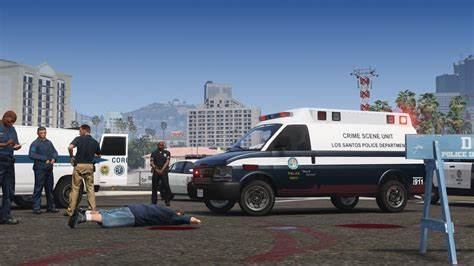
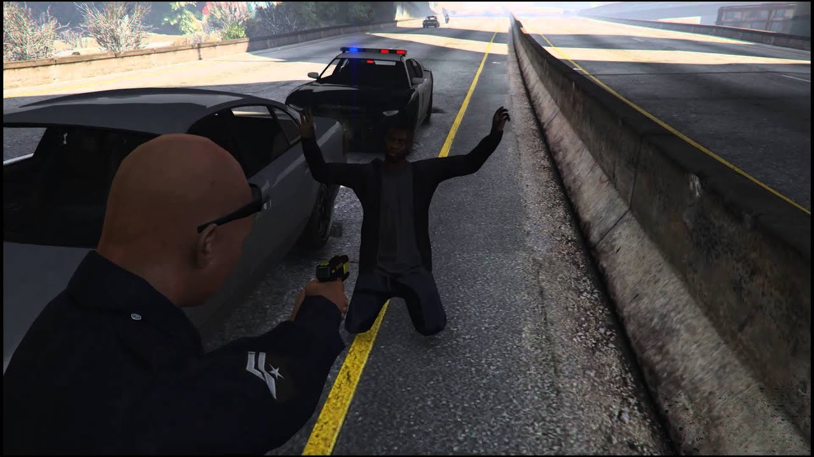

# 📗 Règlement Légal


**Les règles importantes à connaître.**&#x20;


Les mises en <mark style="color:green;">**fédéral /**</mark> <mark style="color:green;">**perquisition**</mark> doivent obligatoirement passer devant un juge/procureur avec ou sans audience du tribunal pour avoir sa validation.\
\
Le juge à tous droits de choisir la peine et sa décision ne peut être contesté en RP. <mark style="color:green;">**Si contestation, contactez les Responsables Légaux.**</mark> \
\
Quand un juge décide de vous mettre en fédéral, <mark style="color:green;">**vous perdez :**</mark>\
**-** L'histoire de votre personnage et donc vos contacts RolePlay.

**-** Pour tout ce qui est manifestation, cela se déroule par dossier, entouré par la LSPD/LSSD pour le bien de nos citoyens. \
**- **<mark style="color:orange;">**Tous les employés légaux qui souhaitent porter une arme de point légalement, hormis la LSPD/LSSD, sont obligés de se procurer un PPA.**</mark>


**Si un infirmier est présent à l'hôpital, vous devez privilégier le soin via une scène RolePlay.**&#x20;


<figure><figcaption></figcaption></figure>

\- Soyez imaginatifs et profitez un maximum de ce que vous avez à disposition dans l'hôpital en terme de mapping ou objets, également avec les props mis à votre disposition. \
\- Si votre candidature est retenue et que vous êtes embauché, vous devez respecter au minimum une période de 7 jours dans la même entreprise, sous peine d'être blacklist du légal. \
\- Les véhicules d'entreprises ne doivent être utilisés que lorsque vous êtes en service.\
**-** Les métiers légaux ne sont pas juste des F6 dont il faut abuser. Il faut jouer chaque scène à son maximum : _les scènes de réanimation, de réparation, de facturation, etc. sont des scènes telles que les autres._ \
\- Chaque personne souhaitant faire partie d'une entreprise doit <mark style="color:red;">**obligatoirement**</mark> avoir payé toutes ses factures.

## <mark style="color:purple;">**I - COMMENT REJOINDRE LE LÉGAL ?**</mark>  

&#x20;

<mark style="color:orange;">**Deux voies**</mark> s'offrent à vous :\
**-** Vous pouvez d'un côté, favoriser de prendre <mark style="color:orange;">**contact In Game**</mark> avec des employés du métier qui vous attire, ainsi que de demander à passer un entretien.\
**-** D'un autre côté, vous pouvez également passer par <mark style="color:orange;">**notre Discord Légal**</mark> afin de remplir les candidatures prédéfinies.

## <mark style="color:red;">Discord Légal de Asentia</mark>

## <mark style="color:purple;">**II - COMMENT SE COMPORTER / AGIR ?**</mark>  

&#x20;

**-** Un policier a pour rôle de protéger les citoyens, l’utilisation d’une arme létale se fait en dernier recours ou en cas de danger imminent, <mark style="color:orange;">**l’utilisation abusive sera sanctionnée.**</mark>\
**-** Les EMS ne sont pas là simplement pour vous effectuer un <mark style="color:orange;">**/healself**</mark>**.** Jouez votre scène d’accident au maximum, sans minimiser vos blessures, afin d’offrir une belle scène aux médecins qui viennent vous aider. Si vous pressez le médecin In Game pour qu’il s’occupe de vous rapidement, ou, si vous sortez des excuses alors que vous avez été dans le coma à la suite d’une bagarre, <mark style="color:orange;">**vous vous encourez des sanctions.**</mark> \
**-** Vous êtes un citoyen modèle, votre premier réflexe dès lors que vous arrivez sur une scène de crime, ou bien que vous assistez à celle-ci, est de <mark style="color:orange;">**prévenir**</mark> les membres de la <mark style="color:orange;">**LSPD/LSSD.**</mark>&#x20;

<figure><figcaption></figcaption></figure>

**-** L'ensemble de nos métiers légaux se doit d'être <mark style="color:orange;">**irréprochable**</mark> au niveau de leur comportement _( respectueux, et insulte si cohérent )._ \
**-** Hors intervention prioritaire, votre conduite doit être irrépréhensible à tout moment, vous pourriez être amené <mark style="color:orange;">**à représenter votre entreprise.**</mark>\
**-** Respecter son lieu de travail est primordial, restez cohérent avec celui-ci: respecter sa hiérarchie d'entreprise <mark style="color:orange;">**est un des principes fondamentaux**</mark> _(parler avec respect à ses supérieurs, se garer correctement devant l’entreprise, ne pas manquer de respect aux clients/citoyens, etc)._\
**-** Favoriser les scènes RolePlay, essayez de construire ou bien développer un ensemble de scènes qui se suivent, tout en gardant <mark style="color:orange;">**une cohérence avec votre métier ou votre personnage.**</mark>\
**-** Lorsque vous êtes en activité légale, et, que vous vous sentez menacé ou alors, que vous pensez que votre sécurité est mise en danger: <mark style="color:orange;">**contactez la LSPD/LSSD**</mark> afin d'obtenir de l'aide. Soyez RolePlay au maximum _(se faire justice soit même fini toujours mal)._\
**-** Être haut placé ou haut gradé dans une entreprise <mark style="color:orange;">**ne vous dispense pas de respecter la loi**</mark>. Elle s'applique à tout citoyen, vous devez donc en être conscient et respecter la loi.\
**-** Lorsque vous êtes en service, respectez les tenues exigées par votre patron cela <mark style="color:orange;">**ajoute de la cohérence RolePlay**</mark> à votre personnage ainsi qu'à votre métier.\
**-** <mark style="color:orange;">**Organiser un événement d’entreprise se fait avec une organisation exemplaire**</mark>**.** A cet égard, cela est à vous de démarcher les joueurs In Game pour les faire participer à votre événement, en utilisant tous les moyens disponibles à votre disposition : bouche-à-oreilles, réseaux sociaux, Weazel News ou encore, vos contacts privés.&#x20;

## <mark style="color:purple;">**III - Démissionner / Mort RP / Register**</mark> 

&#x20;

**-** Pour démissionner, vous devez rédiger un message à votre patron, respectueusement en expliquant les raisons pour lesquelles vous quittez l’entreprise. Enfin, <mark style="color:orange;">**une fois le message validé par un Haut-Gradé, vous pouvez quitter votre métier.**</mark>\
**-** Si vous souhaitez mettre fin à votre personnage RolePlay en scène légale, il faut faire un dossier de Mort RP. Une fois votre demande acceptée, <mark style="color:orange;">**un register**</mark> vous sera donné et vous pourrez l'utiliser après cette scène en question. \
**-** Si vous voulez simplement changer de vie, de projet, de voie et que votre personnage ne convient pas aux critères d'entrée dans les entreprises légales, faites <mark style="color:orange;">**une demande de register en dossier.**</mark>&#x20;

<figure><figcaption></figcaption></figure>
